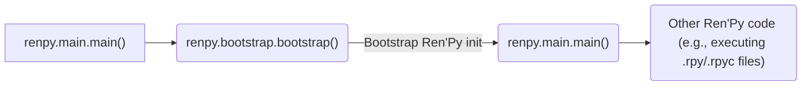
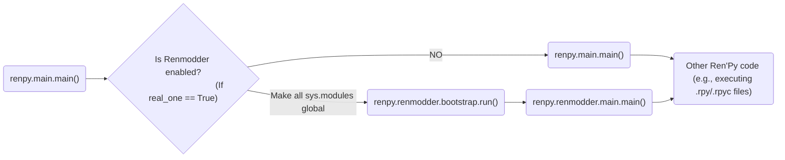

# RenModder mods making tutorial
## First steps
1. Create new folder and in it .py file (Like this: `~/TestMod/mod.py`)
2. Copy `patches/__mod_patch_renmodder/mod.py` file into your directory
3. Let's make first code:
```python
from mod import Mod

# (Mod) IS REQUIRED, WITHOUT IT RENMODDER
# DON'T LOAD THIS CLASS
class TestMod(Mod):
    def __mod_log(self, text: str):
        print(f"[RENMODDER] [{self.name}] ={self.id}= {text}")

    def __init__(self) -> None:
        self.id = id(self)
        self.name = "Test mod"
        self.version = 1.0

    def bootstrap(self):
        self.__mod_log("BOOTSTRAPing...")
    
    def bootstrap_end(self):
        self.__mod_log("END BOOTSTRAPing...")

    def main(self):
        self.__mod_log("Running in main()...")

    def main_end(self):
        self.__mod_log("Running in main() at the end...")

    def unload(self):
        self.__mod_log("Unloading...")
```
### What all this functions mean ?
- bootstrap()       calls at the start of bootstrap()
- bootstrap_end()   calls at the end of bootstrap()
- main()            calls at the start of main() after mod_api fully loading
- main_end()        calls at the end of main() before start execution Ren'Py files code
- unload()          calls at the end of program before TTS, draw, cache and audio shutdowning

### How RenModder work ?
It's modding renpy/bootstrap.py that global all, load renpy/renmodder/bootstrap.py and run it's run() function.

```python
def bootstrap(renpy_base, real_one=False): # Added custom parameter real_one that's bool

    #35516 RENMODDER MOD PATCH # Marks for patcher to find is this file patched
    # global renpy
    if not real_one:
        global l
        for l in sys.modules.keys():
            print(f"[RENMODDER] RENMODDER BOOTSTRAPING: GLOBALING {l}")
            if not '.' in l:
                exec(f'global {l}')

        print('[RENMODDER] RENMODDER BOOTSTRAPING: LOADING RENMODDER MODULE')
        import renpy.renmodder
        renpy.renmodder.bootstrap.run(renpy_base)
        return
    else:
        print("[RENMODDER] RENMODDER BOOTSTRAPING: STARTING ORIGINAL REN'PY BOOTSTRAPING...")
    #35516 RENMODDER MOD PATCH

    # Other original bootstrap() function code...

```

bootstrap() is literally renpy/bootstrap.py but with many changes and at the end it loads renpy.renmodder.main()

```python
import renpy.renmodder.presplash

# some bootstrap.py code
def run(renpy_base):
    # code...

    # If we're not given a command, show the presplash.
    if args.command == "run" and not renpy.mobile:
        global window
        from .presplash import PresplashVenom
        pv = PresplashVenom()
        window = pv.start(basedir, gamedir)

    # other code...
```

### ***TIP: All replaced code you can find in this_repo/patches/__mod_patch_renmodder/ or if you have patched your game: your_game_dir/renpy/renmodder/***

renpy.renmodder.main() is just renpy.main() but with changes and runs custom renpy.renmodder.presplash.PresplashVenom.start() function as renpy.display.presplash.presplash()

### ***That's all. All other code is just an Ren'Py original code, but added more logging***

<h3 style="text-align: center;">Without RenModder patched</h3>



<h3 style="text-align: center;">With RenModder patched</h3>




### How RenModder loads/unloads mods ?
RenModder have a list with Mod() classed loaded mods that called `mods` And in ALL RenModder code it's uses this simple snippet:
```python
for mod in mods:
    LOG_FUNC(f"(REPLACE WITH MSG): {mod.name} ...")
    mod.FUNC_TO_RUN()
```
Example: `patches/__mod_patch_renmodder/main.py`
```python
    # Code...
    for mod in mods:
        main_log(f"Running main() in: {mod.name} ...")
        mod.main()
    # Code...
```


