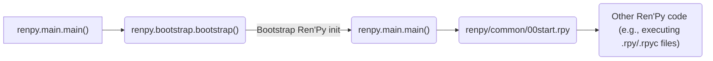
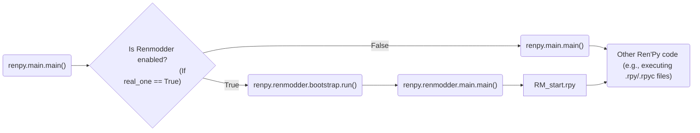

# 🎓 RenModder Mods Making Tutorial

## 🏁 First Steps
1. 📂 Create a new folder and add a `.py` file (like this: `~/TestMod/testmod.py`)
2. 📄 Copy `patches/__mod_patch_renmodder/mod.py` file into your directory
3. 💻 Let's write the first code:
```python
from mod import Mod

# (Mod) IS REQUIRED, WITHOUT IT RENMODDER
# DON'T LOAD THIS CLASS
class TestMod(Mod):
    def __mod_log(self, text: str):
        print(f"[RENMODDER] ({self.name}) {text}")

    def __init__(self) -> None:
        self.id = id(self)
        self.name = "Test mod"
        
        # If you're creating mod and wanna update it... DO NOT CHANGE THIS.
        # If you change this - other mods will not see this mod, RenModder
        # will think that this mod is new, even if it not really new and 
        # other bad things will happen. (sys_name)
        self.sys_name = "lines.test.mod" # author and mod name separted by dots. 
        self.version = 1.0

    def bootstrap(self):
        self.__mod_log("BOOTSTRAPing...")
    
    def bootstrap_end(self):
        self.__mod_log("END BOOTSTRAPing...")

    def main(self):
        self.__mod_log("Running in main()...")

    def main_end(self):
        self.__mod_log("Running in main() at the end...")

    def unload(self):
        self.__mod_log("Unloading...")
```
## 📖 What Do All These Functions Mean?
- **bootstrap()** - Calls at the start of bootstrap()
- **bootstrap_end()** - Calls at the end of bootstrap()
- **main()** - Calls at the start of main() after mod_api fully loading
- **main_end()** - Calls at the end of main() before starting execution of Ren'Py files code
- **unload()** - Calls at the end of the program before TTS, draw, cache, and audio shutdown

## ⚙️ How Does RenModder Work?

It modifies `renpy/bootstrap.py` to globally load and execute `renpy/renmodder/bootstrap.py`, running its run() function.
```python
def bootstrap(renpy_base, real_one=False): # Added custom parameter real_one that's bool

    #35516 RENMODDER MOD PATCH # Marks for patcher to find if this file is patched
    # global renpy
    if not real_one:
	    global l
	    print("[RENMODDER] RENMODDER BOOTSTRAPING: GLOBALING", end=' ')
	    for l in sys.modules.keys():
	        if not '.' in l:
	            print(f"{l},", end=' ')
	            exec(f'global {l}')

	    print('\\n[RENMODDER] RENMODDER BOOTSTRAPING: LOADING RENMODDER MODULE')
	    import renpy.renmodder
	    renpy.renmodder.bootstrap.run(renpy_base)
	    return
	else:
	    print("[RENMODDER] RENMODDER BOOTSTRAPING: STARTING ORIGINAL REN'PY BOOTSTRAPING...")
    #35516 RENMODDER MOD PATCH

    # Other original bootstrap() function code...
```

`bootstrap()` is essentially `renpy/bootstrap.py` but with many changes, and at the end, it loads `renpy.renmodder.main()`

```python
import renpy.renmodder.presplash

# some bootstrap.py code
def run(renpy_base):
    # code...

    # If we're not given a command, show the presplash.
    if args.command == "run" and not renpy.mobile:
        global window
        from .presplash import PresplashVenom
        pv = PresplashVenom()
        window = pv.start(basedir, gamedir)

    # other code...
```

> 💡 ***TIP: All replaced code can be found in `patches/__mod_patch_renmodder/` and in `patches/mod_patch.py` or if you have patched your game: `your_game_dir/renpy/renmodder/`***

`renpy.renmodder.main()` is just `renpy.main()` but with changes and runs the custom `renpy.renmodder.presplash.PresplashVenom.start()` function as `renpy.display.presplash.presplash()`

### ✅ That's all. All other code is just original Ren'Py code but with added logging

<h3 style="text-align: center;">Without RenModder Patched</h3>



<h3 style="text-align: center;">With RenModder Patched</h3>



## 🔄 How Does RenModder Load/Unload Mods?

RenModder maintains a list of loaded mods classified by the `Mod()` class, called `mods`. In all RenModder code, it uses this simple snippet:
```python
for mod in mods:
    LOG_FUNC(f"(REPLACE WITH MSG): {mod.name} ...")
    mod.FUNC_TO_RUN()
```

Example: `patches/__mod_patch_renmodder/main.py`

```python
    # Code...
    for mod in mods:
        main_log(f"Running main() in: {mod.name} ...")
        mod.main()
    # Code...
```

> 💡***TIP: If you want to RenModder load all your code into globals(), not local mod_namespace, write "#LOAD_WITH_GLOBALS" in your code***

## How to use Mod API Client 🌟
0. 🛠️ You need to do all in [First Steps](#-first-steps)
1. 📂 Copy `mod_api.py` and `mod_api_proto.py` files from `patches/__mod_patch_renmodder/` into your directory
2. 📥 Import `mod_api`:

```python
# ...
import renpy.renmodder.mod_api as mod_api
# import mod_api # For autocompletion you can use this
# ...
```

3. In your class in `bootstrap()` or another functions write this:

```python
# ...
class TestMod(Mod):
    # Example using bootstrap() as init for mod_api:
    def bootstrap(self):
        failed = 0
        while True:
            self.client = mod_api.register(self.sys_name, self.version, self.id)
            if self.client:
                self.client, self.token = self.client
                break
            
            if failed >= 3:
                self.__mod_log("FAILED TO REGISTER MOD. ABORTING...")
                exit(1)
            failed += 1
# ...
```
4. In result you have to have code like this:
```python
#LOAD_WITH_GLOBALS # Tell RenModder to load all memory into global, not local one. Can be disabled.
from renpy.renmodder.mod import Mod
import renpy.renmodder.mod_api as mod_api

class APITestMod(Mod):
    def __mod_log(self, text: str):
        print(f"[RENMODDER] ({self.name}) {text}")

    def __init__(self) -> None:
        self.id = id(self)
        self.name = "Test mod"
        self.sys_name = "lines.api.test.mod"
        self.version = 1.0

    def bootstrap(self):
        self.__mod_log("Registering in RenModder Mod API system...")
        failed = 0
        while True:
            self.client = mod_api.register(self.sys_name, self.version, self.id)
            if self.client:
                self.client, self.token = self.client
                break
            if failed >= 3:
                self.__mod_log("FAILED TO REGISTER IN RENMODDER MOD API. ABORTING...")
                exit(1)
            failed += 1

        self.__mod_log("====================")
        self.__mod_log(self.client)
        self.__mod_log(self.client_token)
        self.__mod_log("====================")
        
    
    def bootstrap_end(self):
        self.__mod_log("Running in bootstrap() at the end...")

    def main(self):
        self.__mod_log("Running in main()...")

    def main_end(self):
        self.__mod_log("Running in main() at the end...")

    def unload(self):
        self.__mod_log("Unloading...")
```

## Mod API functions
***Mod api have a lot of functions. Here is the list of all that***

| Name | Func Name | Uses server | Arguments | Notes |
| :------ | :-----: | :-----: | :-----: | ------: |
| Wait for mod | wait_mod | YES | client, token, mod_name, run_loaded | run_loaded - functions to run after waited \| mod_name - Mod system name to wait it |
| Get loaded mods | get_loaded_mods | YES | client, token | wait_mod uses this function |
| Run Ren'Py code | run_renpy | 
